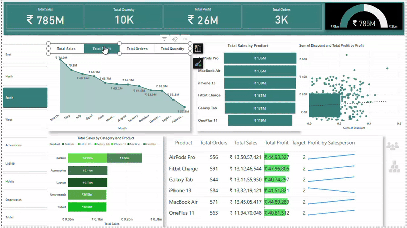

# Electra Pvt Ltd Power BI Dashboard

This report provides a detailed analysis of the key performance indicators (KPIs) presented in the Electra Pvt Ltd Power BI dashboard, offering actionable insights and strategic recommendations to enhance the company's performance. The dashboard provides a comprehensive view of Electra Pvt Ltd's sales performance, profitability, order volume, and product-level analytics.

## Key Performance Highlights

Electra Pvt Ltd demonstrates strong overall performance, with significant achievements across various metrics:

* **Total Sales:** ₹2 billion
* **Total Quantity Sold:** 30,000 units
* **Total Profit:** ₹75 million
* **Total Orders:** 10,000

These figures indicate a substantial market presence and healthy business activity for Electra Pvt Ltd within the electronics sector.

## Trend Analysis

### Sales Trend Over Time

The "Total Sales" chart reveals a fluctuating sales trend for Electra Pvt Ltd over the past year. While there were peaks and troughs, the overall trajectory shows a decline towards the latter part of the year, followed by a slight recovery in the most recent months (November and February).

**Insight:** The downward trend in Electra Pvt Ltd's sales from August to November warrants further investigation to identify the underlying causes specific to the electronics market and the company's operations. Factors such as seasonality in electronics demand, new product launches by competitors, or specific internal events could be contributing to this pattern. The recent uptick is encouraging and should be monitored closely to ascertain if it signifies a sustained recovery for Electra Pvt Ltd.

### Regional Performance

The bar chart displaying "Total Sales," "Total Profit," "Total Orders," and "Total Quantity" by region allows for a comparative analysis of Electra Pvt Ltd's regional contributions. However, the image does not clearly label the performance of each region (East, North, South, West).

**Insight:** A detailed breakdown of Electra Pvt Ltd's regional performance is crucial for understanding geographic strengths and weaknesses within the Indian electronics market. Identifying high-performing regions can inform resource allocation and expansion strategies for Electra Pvt Ltd, while underperforming regions may require targeted interventions or localized marketing efforts.

**Recommendation:** Future iterations of Electra Pvt Ltd's dashboard should clearly label and highlight the performance metrics for each region to facilitate easier comparison and analysis of their market penetration and sales effectiveness across India.

## Product Performance Analysis

### Total Sales by Product

The horizontal bar chart titled "Total Sales by Product" provides a clear ranking of Electra Pvt Ltd's product portfolio based on their contribution to total sales.

| Product       | Total Sales (₹ Million) |
|---------------|-----------------------|
| Fitbit Charge | 407                   |
| Galaxy Tab    | 394                   |
| AirPods Pro   | 380                   |
| OnePlus 11    | 385                   |
| MacBook Air   | 381                   |
| iPhone 13     | 378                   |

**Insight:** Within Electra Pvt Ltd's offerings, Fitbit Charge emerges as the top-performing product in terms of total sales, closely followed by Galaxy Tab and AirPods Pro. iPhone 13 shows the lowest sales among the highlighted products. This suggests varying consumer demand and market acceptance for different product categories within Electra Pvt Ltd's range.

**Recommendation:** Electra Pvt Ltd should focus on leveraging the success of top-performing products like Fitbit Charge through targeted marketing campaigns, strategic partnerships, and efficient inventory management. Simultaneously, investigate the reasons for the relatively lower sales of iPhone 13 within their product portfolio – this could involve pricing analysis, marketing effectiveness review, or understanding consumer preferences within their target market.

### Detailed Product Performance Table

The table below provides a more granular view of Electra Pvt Ltd's product performance, including total orders, total sales, total profit, and target profit by salesperson.

| Product       | Total Orders | Total Sales (₹) | Total Profit (₹) | Target Profit by Salesperson |
|---------------|--------------|-----------------|------------------|------------------------------|
| AirPods Pro   | 1664         | 38,95,13,605   | 1,28,67,325      | 2                            |
| Fitbit Charge | 1693         | 40,70,58,257   | 1,33,92,717      | 2                            |
| Galaxy Tab    | 1645         | 39,38,03,418   | 1,20,02,010      | 2                            |
| iPhone 13     | 1671         | 37,94,63,627   | 1,20,79,162      | 2                            |
| MacBook Air   | 1652         | 38,07,96,179   | 1,24,22,935      | 2                            |
| OnePlus 11    | 1675         | 38,52,59,616   | 1,27,25,136      | 2                            |

  

**Insights:**

* Fitbit Charge leads in both total sales and total profit for Electra Pvt Ltd, reinforcing its strong market performance and profitability contribution.
* AirPods Pro has the highest number of orders, indicating strong demand volume, which Electra Pvt Ltd can leverage through effective supply chain management.
* The target profit by salesperson appears to be consistently set at '2' across all products for Electra Pvt Ltd. This might represent a standardized target or require further clarification on its unit of measure (e.g., percentage, absolute value) and its significance in driving individual sales team performance.

**Recommendations:**

* Electra Pvt Ltd should analyze the correlation between order volume and profit margin for each product to optimize pricing strategies and promotional campaigns, potentially focusing on higher-volume products like AirPods Pro to maximize overall profitability.
* Investigate the basis and implications of the "Target Profit by Salesperson" metric within Electra Pvt Ltd's sales management framework to ensure its effectiveness in motivating the sales team and aligning individual targets with overall business objectives.

### Total Sales by Category and Product

The stacked bar chart "Total Sales by Category and Product" provides a breakdown of Electra Pvt Ltd's sales contribution by product within different electronics categories (Accessories, Laptop, Mobile, Smartwatch, Tablets).

**Insight:** The "Mobile" category appears to be the dominant contributor to Electra Pvt Ltd's total sales, with OnePlus 11 showing the highest sales within this category. Laptops also represent a significant portion of the total sales, indicating the importance of these segments for Electra Pvt Ltd's revenue generation.

**Recommendation:** Electra Pvt Ltd should focus on strengthening its market position in key categories like Mobile and Laptop. Further analyze the individual product contributions within each category to identify growth opportunities, potential areas for product line expansion, and strategies to address underperforming sub-categories.

## Discount and Profit Analysis

The scatter plot visualizing the "Sum of Discount" against the "Sum of Discount and Total Profit" provides insights into the relationship between discounts offered by Electra Pvt Ltd and overall profitability.

**Insight:** The plot suggests a generally positive correlation between the sum of discount and the sum of discount plus total profit for Electra Pvt Ltd. However, the significant spread indicates that higher discounts do not always translate to proportionally higher overall profit. Some instances of high discounts correspond to relatively lower profit levels, suggesting potential inefficiencies in discount strategies for Electra Pvt Ltd.

**Recommendation:** Electra Pvt Ltd should conduct a detailed analysis of the impact of different discount levels on profitability for each product and customer segment. Optimize discount strategies to maximize profit without negatively impacting sales volume. Consider implementing tiered discount structures, targeted promotions for specific products or customer groups, and a clear framework for discount approvals to ensure profitability is maintained.

## Overall Recommendations for Electra Pvt Ltd

1.  **Investigate Sales Decline:** Conduct a thorough investigation into the reasons behind the sales decline observed from August to November. Analyze internal factors (e.g., inventory management, marketing campaigns) and external factors (e.g., competitor activities, market trends in electronics) that may have contributed to this trend for Electra Pvt Ltd.
2.  **Enhance Regional Analysis:** Clearly label regional performance metrics in Electra Pvt Ltd's dashboard to facilitate effective geographic analysis and the development of targeted regional sales and marketing strategies within the Indian market.
3.  **Optimize Product Portfolio:** Leverage the strengths of top-performing products like Fitbit Charge and AirPods Pro through focused marketing and efficient supply chains. Address the relatively lower performance of iPhone 13 through targeted marketing efforts, pricing adjustments, or a review of its positioning within Electra Pvt Ltd's overall product offering.
4.  **Refine Discount Strategy:** Analyze the relationship between discounts and profitability at a granular level for Electra Pvt Ltd's product range. Implement data-driven discount strategies to maximize profit margins while achieving sales targets.
5.  **Clarify Sales Targets:** Gain a clear understanding of the "Target Profit by Salesperson" metric and its role in Electra Pvt Ltd's sales performance management. Ensure it is effectively communicated, aligned with overall profit goals, and contributes to motivating the sales team.
6.  **Continuous Monitoring and Review:** Regularly monitor the KPIs presented in Electra Pvt Ltd's dashboard and conduct periodic reviews to identify emerging trends in the electronics market, potential issues specific to the company, and opportunities for optimization across sales, marketing, and product strategies.

This comprehensive analysis provides a solid foundation for strategic decision-making aimed at driving sales growth, improving profitability, and optimizing overall business performance for Electra Pvt Ltd in the competitive electronics market.
